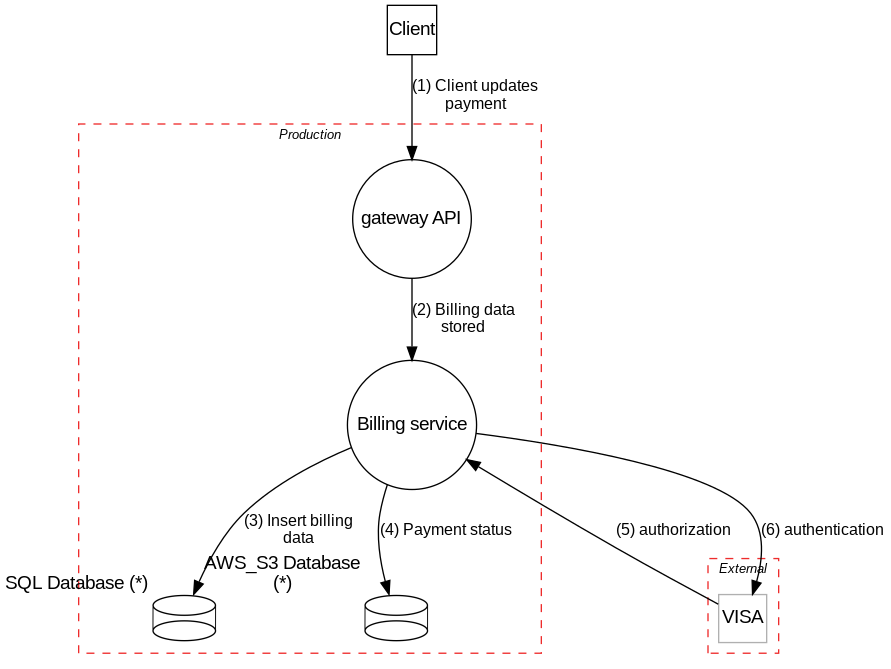

# Mandatory 1: Fake Aps threat model 
***

## System Description

{tm.description}

## Dataflow Diagram

## Dataflows

Name|From|To |Data|Protocol|Port
----|----|---|----|--------|----
{dataflows:repeat:{{item.name}}|{{item.source.name}}|{{item.sink.name}}|{{item.data}}|{{item.protocol}}|{{item.dstPort}}
}

## Findings

{elements:repeat:{{item.findings:if:
### {{item.name}}

{{item.findings:repeat:
**Threat**: {{{{item.id}}}} - {{{{item.description}}}}

**Severity**: {{{{item.severity}}}}

**Mitigations**: {{{{item.mitigations}}}}

**References**: {{{{item.references}}}}

}}}}}

